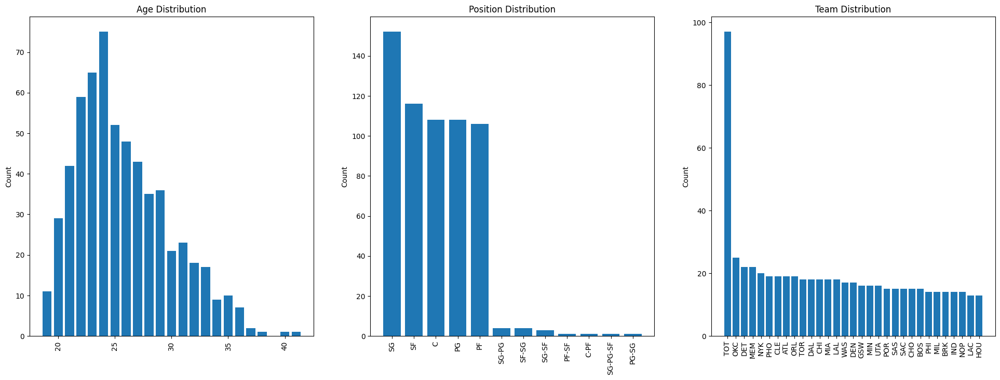

## Machine Learning Final Project Report

##### Isabelle Crow & Souley Diallo

##### Due: 8/2/2024

<u>[GitHub Repository](https://github.com/Clarkson-Applied-Data-Science/2024_IA651_Crow_Diallo)</u>

---

### <u>Motivation</u>
The National Basketball Association (NBA) is the premier global men’s professional basketball league. Traditionally, players have specific positions, but the sport is evolving towards a more positionless style, with centers attempting more three-point shots and guards driving to the basket for dunks. In this project, we will apply PCA techniques to reduce the dimensionality of the dataset and identify the players who explain the most variance. Then explore the key features that are most important for predicting a player’s position. The primary goal of this project is to accurately predict a player’s position based on various features.

### <u>Exploratory Data Analysis - EDA</u>

##### Feature Correlation and Distribution:
After examining the datasets, we found a few missing values. Since the dataset is small, we used imputation techniques to fill in the missing values with the most frequent value in each specific column. Then plotted a heatmap to visualize the correlation matrix of the numerical features as shown in Figure 1 below.

_Figure1: Correlation Matrix_

Next, examined the distribution of the categorical variables and created a bar plot for each variable (see Figure 2).

_Figure 2: Categorical Variable Distributions_

##### Feature Engineering:

After conducting the Exploratory Data Analysis (EDA), we engineered features for average rating and average rebound, which utilized the average of offensive rating and defensive rating. This approach helps to better capture the underlying meaning of the data. 

##### Identification and removal of outlier:

Now that the initial exploration is complete, we used the interquartile range method to identify and remove all outliers.

_Figure 3: Boxplot with outliers_

_Figure 4: Boxplot with Removed Outliers_

### <u>Principal Component Analysis - PCA</u>

To further analyze the datasets, we used principal component analysis to observe how the variance is distributed within the components. We then used the explained variance ratio from the PCA to create a clear plot for visualizing the distribution.

_Figure 5: Principal Component Analysis Cree Plot_

Similarly, we need a new plot for the first two PCAs to see which features contributed the most to either component.

_Figure 6: Biplot of PC1 & PC2_

From here, then we combined the pca loadings to the filtered data to  create a DataFrame. With this, we are able to filter out this data see which player are top performers by their principal component.

| Features        | Top Performers | Bottom Performers |
| --------------- | -------------- | ----------------- |
| Age             | 25.733333      | 25.800000         |
| N_Games         | 67.333333      | 24.933333         |
| Game_Started    | 52.266667      | 2.866667          |
| Minute_played   | 1985.000000    | 295.933333        |
| Field_goal      | 10.913333      | 4.366667          |
| Goal_attempt    | 20.833333      | 13.220000         |
| Field_goal%     | 0.536133       | 0.337000          |
| 3points_scored  | 1.693333       | 2.426667          |
| 3points_Assists | 4.733333       | 8.126667          |
| 3points%        | 0.331067       | 0.296133          |

_Table 1: Top Features by Performance Using PC1_

| Player              | Age | Field_goal% | PC1      |
| ------------------- | --- | ----------- | -------- |
| Jonas Valančiūnas | 29  | 0.544       | 8.318119 |
| Karl-Anthony Towns  | 26  | 0.529       | 8.273607 |
| Deandre Ayton       | 23  | 0.634       | 8.020961 |
| Domantas Sabonis    | 25  | 0.573       | 7.571184 |
| Montrezl Harrell    | 28  | 0.645       | 7.422051 |
| Brandon Clarke      | 25  | 0.644       | 6.852951 |
| Jayson Tatum        | 23  | 0.453       | 6.584736 |
| Pascal Siakam       | 27  | 0.494       | 6.379467 |
| Julius Randle       | 27  | 0.411       | 5.614400 |
| Christian Wood      | 26  | 0.501       | 5.580332 |

_Table 2: Top 10 Players by PC1_

| Features        | Top Performers | Bottom Performers |
| --------------- | -------------- | ----------------- |
| Age             | 26.533333      | 25.200000         |
| N_Games         | 59.866667      | 42.133333         |
| Game_Started    | 52.666667      | 14.000000         |
| Minute_played   | 2028.000000    | 741.866667        |
| Field_goal      | 11.313333      | 6.733333          |
| Goal_attempt    | 25.526667      | 13.253333         |
| Field_goal%     | 0.442067       | 0.506867          |
| 3points_scored  | 4.080000       | 0.860000          |
| 3points_Assists | 11.100000      | 2.660000          |
| 3points%        | 0.362867       | 0.299067          |

_Table 3: Top Features by Performance Using PC2_

| Player           | Age | Field_goal% | PC2      |
| ---------------- | --- | ----------- | -------- |
| Stephen Curry    | 33  | 0.437       | 6.204114 |
| Damian Lillard   | 31  | 0.402       | 5.709959 |
| Devin Booker     | 25  | 0.466       | 5.432972 |
| Zach LaVine      | 26  | 0.476       | 5.354128 |
| Anfernee Simons  | 22  | 0.443       | 4.889255 |
| Kyrie Irving     | 29  | 0.469       | 4.831964 |
| D'Angelo Russell | 25  | 0.411       | 4.753890 |
| Reggie Jackson   | 31  | 0.392       | 4.607646 |
| CJ McCollum      | 30  | 0.460       | 4.585659 |
| Jayson Tatum     | 23  | 0.453       | 4.442239 |

_Table 4: Top 10 Players by PC2_

### <u>Feature Importance</u>
Before selecting, training, and evaluating the model, we used a random forest classifier to determine which features are most important for predicting our target variable. This process helps to reduce noise, which can cause overfitting and result in poor model performance.

_Figure 7: Feature Importance After Feature Engineering_

### <u>More Feature Engineering</u>

Additionally, we engineered more features before training to enhance our model’s ability to generalize and to capture the correlations between features. 

### <u>Model Training and Evaluation</u>

To train our model, we utilized the top 34 most important features. This approach helps us capture the majority of the relevant information for our target variable. We implemented a pipeline to prevent data leakage and applied oversampling techniques to ensure balanced class distribution in our target variable and training data. Additionally, we used stratified cross-validation to maintain the same class proportions in each fold as in the original dataset.

Despite these efforts, our model achieved a best accuracy score of 54.95%. This low accuracy indicates that our model may be overfitting, which is further evidenced by the confusion matrix shown below.

| Classifier           | SVC                                                                         |
| -------------------- | --------------------------------------------------------------------------- |
| Using KFold strategy | StratifiedKFold_10                                                          |
| Best Score           | 0.5494623655913978                                                          |
| Best Parameters      | {'svc__C': 10, 'svc__degree': 1, 'svc__gamma': 0.001, 'svc__kernel': 'rbf'} |

|              | precision | recall | f1-score | support |
| ------------ | --------- | ------ | -------- | ------- |
| C            | 0.45      | 0.62   | 0.53     | 8       |
| PF           | 0.35      | 0.46   | 0.40     | 13      |
| PG           | 0.53      | 0.62   | 0.57     | 13      |
| SF           | 0.21      | 0.17   | 0.19     | 18      |
| SG           | 0.65      | 0.52   | 0.58     | 25      |
| accuracy     |           |        | 0.45     | 77      |
| macro avg    | 0.44      | 0.48   | 0.45     | 77      |
| weighted avg | 0.46      | 0.45   | 0.45     | 77      |

_Table 5: Model Classificatin Report_

_Figure 8: Confusion Matrix_

### <u>Model Limitation</u>
One limitation is the size of the dataset, which is significantly small. The data might also be synthesized. To improve this model, acquiring more data from a trusted source to avoid synthesized data would be beneficial.

### Sample Test
We created three rows of new test data and below are the results. 
| SG  | PG  | PF  |
| --- | --- | --- |

_Table 6: Predicted Labels_

