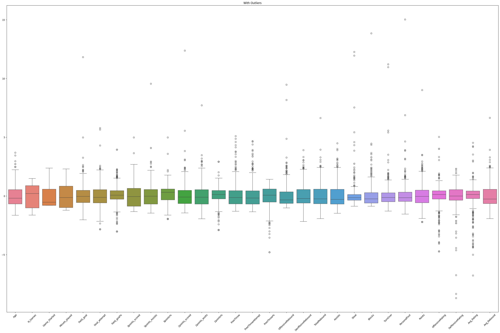
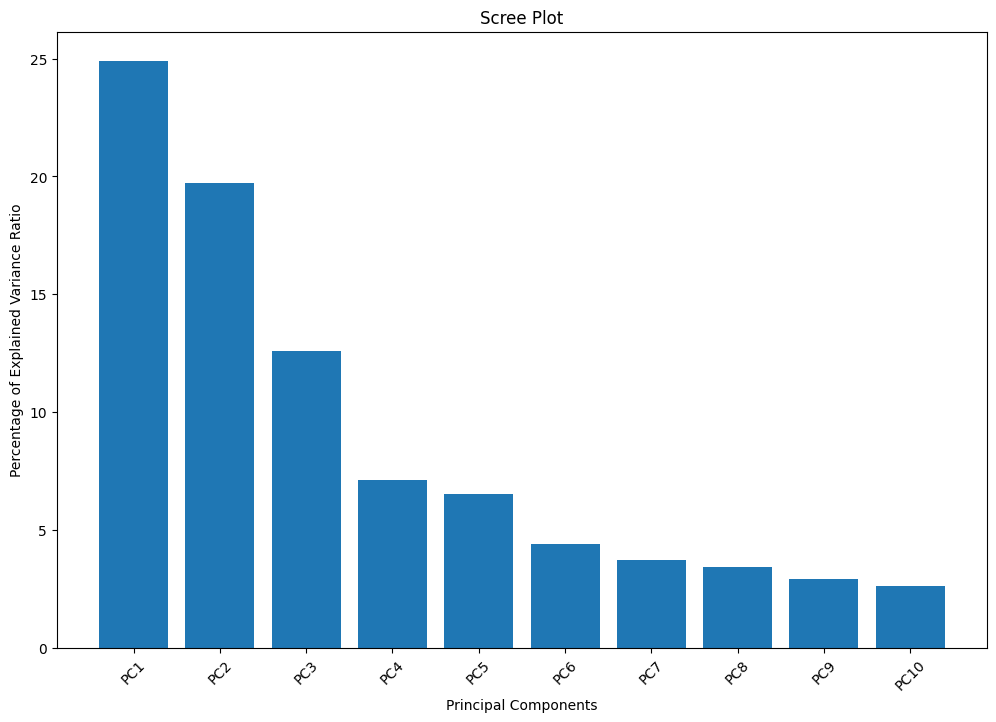
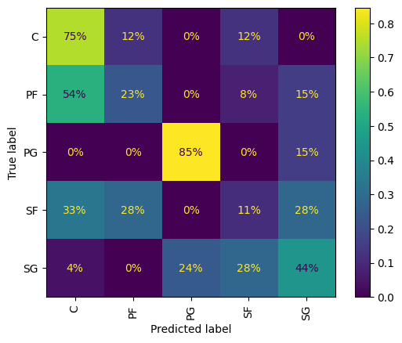

## Machine Learning Final Project Report

##### Isabelle Crow & Souley Diallo

##### Due: 8/2/2024

<u>[GitHub Repository](https://github.com/Clarkson-Applied-Data-Science/2024_IA651_Crow_Diallo)</u>

---

### <u>Problem Statement</u>
The National Basketball Association (NBA) is the global premier men’s professional basketball league. While players traditionally have specific positions, the sport is evolving to be more positionless, with centers attempting more three-point shots and guards driving to the basket for dunks. Using this dataset, we will apply PCA techniques to identify players on a lower dimension and determine which players explain the most variance. We will also explore which features are most important for predicting a player's position.

### <u>Exploratory Data Analysis - EDA</u>

##### Feature Correlation and Distribution:
After examining the datasets, we found a few missing values. Since the dataset is small, we used imputation techniques to fill in the missing values with the most frequent value in each specific column. We then plotted a heatmap to visualize the correlation matrix of the numerical features as shown in Figure 1 below.

_Figure1: Correlation Matrix_

Next, we examined the distribution of the categorical variables and created a bar plot for each variable (see Figure 2).

_Figure 2: Categorical Variable Distributions_

##### Feature Engineering:

After conducting the Exploratory Data Analysis (EDA), we engineered a couple of features. First, we created Age Binned categories to allow us to see which age group explained the most variance and identify the groups that contained the top and worst performers. We also created another feature for performance, which utilized the average of offensive rating and defensive rating. This does a better job of understanding the underlying meaning of the data. After creating these features, we then dropped the original features.

##### Identification and removal of outlier:

Now that the initial exploration is complete, we used the interquartile range method to identify and remove all outliers.

_Figure 3: Boxplot with outliers_

_Figure 4: Boxplot with Removed Outliers_

### <u>Principal Component Analysis - PCA</u>

To further analyze the datasets, we used principal component analysis to observe how the variance is distributed within the components. We then used the explained variance ratio from the PCA to create a clear plot for visualizing the distribution.

_Figure 5: Principal Component Analysis Cree Plot_

Similarly, we need a new plot for the first two PCAs to see which features contributed the most to either component.

_Figure 6: Biplot of PC1 & PC2_

From here, then we combined the pca loadings to the filtered data to  create a DataFrame. With this, we are able to filter out this data see which player are top performers by sorting their variannces on asending order.

| Features       | Top Performers | Bottom Performers |
| -------------- | -------------- | ----------------- |
| N_Games        | 52.1           | 15.8              |
| Game_Started   | 31.0           | 2.0               |
| Minute_played  | 1471.7         | 203.3             |
| Field_goal     | 10.96          | 3.96              |
| Goal_attempt   | 18.65          | 13.2              |
| Field_goal%    | 0.5963         | 0.3021            |
| 3points_scored | 0.57           | 2.41              |
| 3points_Assits | 1.86           | 8.76              |
| 3points%       | 0.2699         | 0.2684            |
| 2points_scored | 10.41          | 1.53              |

_Table 1: Performance Comparison Based on Features_

### <u>Feature Importance</u>
Before selecting, training, and evaluating the model, we used a random forest classifier to determine which features are most important for predicting our target variable. This process helps to reduce noise, which can cause overfitting and result in poor model performance.

_Figure 7: Feature Importance_

### <u>Model Training and Evaluation</u>

### <u>Conclusion</u>
