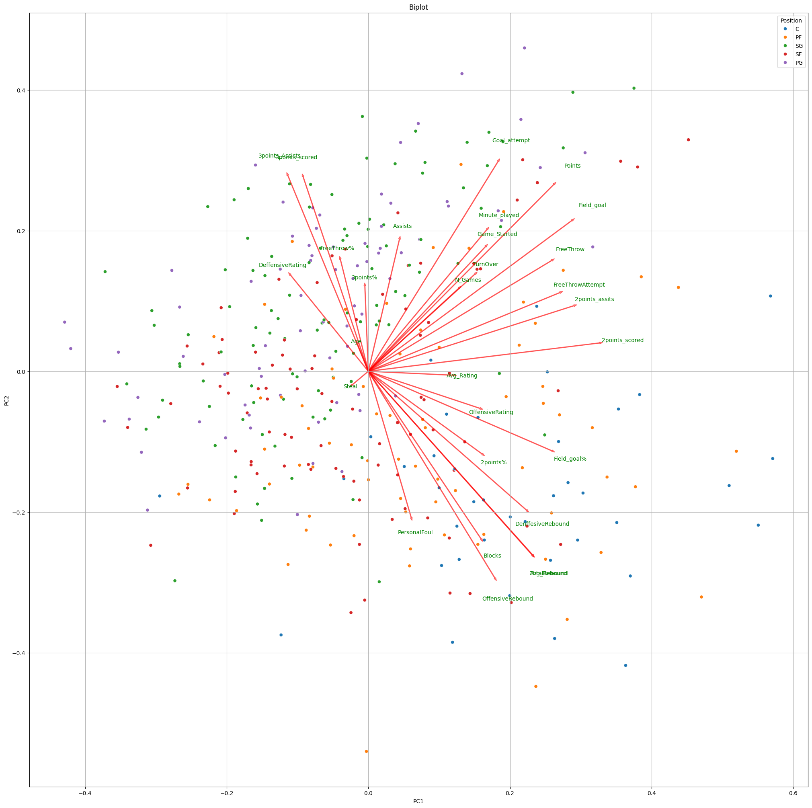
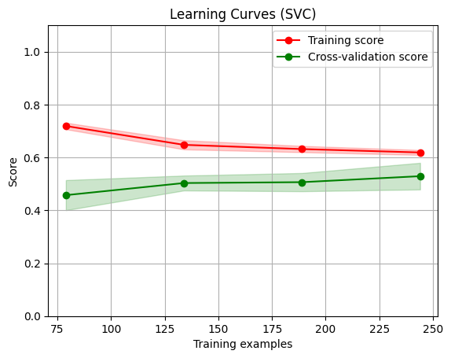

# Machine Learning Final Project Report

**Authors:** Isabelle Crow & Souley Diallo  
**Due Date:** August 2, 2024

<u>[GitHub Repository](https://github.com/Clarkson-Applied-Data-Science/2024_IA651_Crow_Diallo)</u>

---

## Introduction

In this project, we aim to predict the positions of NBA players using a dataset containing various performance metrics from the 2021-2022 regular season. The dataset, sourced from basketball-reference.com and collected via the ballr package in R, includes performance statistics for 812 player-team stints. The primary goal is to build a predictive model that classifies players into positions based on their performance metrics.

Accurately predicting player positions can have significant implications for team management, game strategy, and player evaluation. By analyzing and understanding these metrics, teams can make informed decisions about player utilization and strategy. Additionally, we incorporated a learning curve analysis to evaluate the model's performance and its ability to generalize with varying amounts of training data.

## Dataset Description

The dataset used in this project is the **National Basketball Association (NBA) Player Statistics** from the 2021-2022 regular season, sourced from [basketball-reference.com](https://data.scorenetwork.org/basketball/nba-player-stats.html). The data was collected using the `ballr` package in R, a tool designed to access current and historical basketball statistics.

This dataset encompasses statistics for 812 player-team stints during the 2021-2022 NBA season. It includes performance data for players across multiple teams, with individual rows representing each team's performance and a summary row indicating total performance for players who were traded (where `tm = TOT` denotes total season performance). All statistics are normalized per 100 team possessions to account for variations in playing time.

**Variables in the dataset:**
- **player:** Name of the player
- **pos:** Player’s designated position
- **age:** Player’s age as of February 1st of the season
- **tm:** Name of the team
- **g:** Number of games played
- **gs:** Number of games started
- **mp:** Number of minutes played
- **fg:** Field goals per 100 team possessions
- **fga:** Field goal attempts per 100 team possessions
- **fgpercent:** Field goal percentage
- **x3p:** Three-point field goals per 100 team possessions
- **x3pa:** Three-point field goal attempts per 100 team possessions
- **x3ppercent:** Three-point field goal percentage
- **x2p:** Two-point field goals per 100 team possessions
- **x2pa:** Two-point field goal attempts per 100 team possessions
- **x2ppercent:** Two-point field goal percentage
- **ft:** Free throws per 100 team possessions
- **fta:** Free throw attempts per 100 team possessions
- **ftpercent:** Free throw percentage
- **orb:** Offensive rebounds per 100 team possessions
- **drb:** Defensive rebounds per 100 team possessions
- **trb:** Total rebounds per 100 team possessions
- **ast:** Assists per 100 team possessions
- **stl:** Steals per 100 team possessions
- **blk:** Blocks per 100 team possessions
- **tov:** Turnovers per 100 team possessions
- **pf:** Personal fouls per 100 team possessions
- **pts:** Points per 100 team possessions
- **ortg:** Offensive Rating (estimate of points produced per 100 possessions)
- **drtg:** Defensive Rating (estimate of points allowed per 100 possessions)

## Prediction Objective

The primary goal of this project is to predict NBA player positions based on various performance metrics. Accurate prediction of player positions can enhance team strategies and player evaluations, thereby contributing to more informed decision-making in both team management and player scouting. 

## Process Overview

The project follows a structured approach to develop and evaluate predictive models for NBA player positions. Here’s a summary of the process:

1. **Data Preparation**
   - **Feature Selection:** We identified the most relevant features for predicting player positions, such as assists, rebounds, and shooting percentages. We also applied feature engineering to create new features and encoded categorical variables for model training.
   - **Target Variable:** The target variable is the player position, which is a categorical variable representing different roles (e.g., PG, SG, SF).

2. **Data Splitting**
   - The dataset was split into training and testing sets using an 80/20 split ratio. This division ensures that models are trained on one portion of the data and evaluated on another, unseen portion.

3. **Pipeline Creation**
   - **Preprocessing Pipelines:** We created pipelines for each classifier to integrate preprocessing steps and modeling within a single workflow. The pipelines included:
     - **StandardScaler:** To standardize feature values.
     - **SMOTE:** To address class imbalance by oversampling minority classes.
   - **Classifiers:** We explored two classifiers:
     - **Support Vector Classifier (SVC)**
     - **Random Forest Classifier**

4. **Hyperparameter Tuning**
   - We used GridSearchCV for hyperparameter tuning to enhance model performance. This involved:
     - **Defining Hyperparameters:** We specified a range of hyperparameters for each classifier to explore.
     - **Cross-Validation:** Various KFold strategies were employed, including both StratifiedKFold and KFold with different numbers of splits, to ensure robust model evaluation.

5. **Model Evaluation**
   - **Performance Metrics:** After tuning, models were evaluated using accuracy, confusion matrices, and classification reports. This assessment provided insights into model performance and areas for improvement.
   - **Confusion Matrix:** We visualized the models' performance with confusion matrices to understand strengths and weaknesses.
   - **Learning Curve Analysis:** The learning curve analysis was conducted to assess the model's performance and generalization capability with varying amounts of training data.

6. **Results and Analysis**
   - The best-performing models were selected based on their best score and other metrics. The results highlighted the predictive power of different models and the impact of various hyperparameters.

This structured approach allowed us to build and refine predictive models systematically, ensuring robust and reliable predictions of NBA player positions.

### Exploratory Data Analysis (EDA)

For exploratory data analysis, we focused on both the features and the target variables. The features included metrics such as field goal percentage, points scored, and games played, while the target variable was the player position (e.g., guard, forward, center). This is a classification problem, given the categorical nature of player positions.

The dataset comprises 812 observations and 30 features. We noted that some features, such as field goal percentage, were imbalanced, which could impact model performance. Additionally, the distribution of player positions was analyzed to ensure balanced representation.

Correlation analysis revealed strong relationships among certain features, which was illustrated in the correlation matrix (Figure 1).

  
   
  <em>Figure 1: Correlation Matrix</em>

Next, we analyzed the distribution of categorical variables, presenting bar plots for each variable (see Figure 2).

  
   
  <em>Figure 2: Categorical Variable Distributions</em>

### Feature Engineering:

Feature engineering involved creating new features such as average rating and average rebound to capture the underlying data patterns more effectively. We applied label encoding to categorical variables to facilitate model training. Additionally, cross features were generated to improve model performance and capture complex interactions between features.

### Identification and removal of outlier:

We utilized the interquartile range method to identify and eliminate outliers after completing the initial exploration.

  
   
  <em>Figure 3: Boxplots with Outliers</em>

  
   
  <em>Figure 4: Boxplot with Outliers Removed</em>

## Principal Component Analysis (PCA)

To further analyze the dataset, we applied PCA to examine the distribution of variance across components. We used the explained variance ratio from PCA to generate a clear plot for visualization.

  
   
  <em>Figure 5: PCA Cree Plot</em>

We also created a biplot for the first two principal components to identify the features that most significantly contribute to each component.

  
   
  <em>Figure 6: Biplot of PC1 & PC2</em>

Combining PCA loadings with filtered data, we generated a DataFrame to highlight top performers based on their principal component scores.

_Table 1: Top Features by Performance Using PC1_

| Features        | Top Performers | Bottom Performers |
| --------------- | -------------- | ----------------- |
| Age             | 25.733333      | 25.800000         |
| N_Games         | 67.333333      | 24.933333         |
| Game_Started    | 52.266667      | 2.866667          |
| Minute_played   | 1985.000000    | 295.933333        |
| Field_goal      | 10.913333      | 4.366667          |
| Goal_attempt    | 20.833333      | 13.220000         |
| Field_goal%     | 0.536133       | 0.337000          |
| 3points_scored  | 1.693333       | 2.426667          |
| 3points_Assists | 4.733333       | 8.126667          |
| 3points%        | 0.331067       | 0.296133          |

_Table 2: Top 10 Players by PC1_

| Player              | Age | Field_goal% | PC1      |
| ------------------- | --- | ----------- | -------- |
| Jonas Valančiūnas | 29  | 0.544       | 8.318119 |
| Karl-Anthony Towns  | 26  | 0.529       | 8.273607 |
| Deandre Ayton       | 23  | 0.634       | 8.020961 |
| Domantas Sabonis    | 25  | 0.573       | 7.571184 |
| Montrezl Harrell    | 28  | 0.645       | 7.422051 |
| Brandon Clarke      | 25  | 0.644       | 6.852951 |
| Jayson Tatum        | 23  | 0.453       | 6.584736 |
| Pascal Siakam       | 27  | 0.494       | 6.379467 |
| Julius Randle       | 27  | 0.411       | 5.614400 |
| Christian Wood      | 26  | 0.501       | 5.580332 |

_Table 3: Top Features by Performance Using PC2_

| Features        | Top Performers | Bottom Performers |
| --------------- | -------------- | ----------------- |
| Age             | 26.533333      | 25.200000         |
| N_Games         | 59.866667      | 42.133333         |
| Game_Started    | 52.666667      | 14.000000         |
| Minute_played   | 2028.000000    | 741.866667        |
| Field_goal      | 11.313333      | 6.733333          |
| Goal_attempt    | 25.526667      | 13.253333         |
| Field_goal%     | 0.442067       | 0.506867          |
| 3points_scored  | 4.080000       | 0.860000          |
| 3points_Assists | 11.100000      | 2.660000          |
| 3points%        | 0.362867       | 0.299067          |

_Table 4: Top 10 Players by PC2_

| Player           | Age | Field_goal% | PC2      |
| ---------------- | --- | ----------- | -------- |
| Stephen Curry    | 33  | 0.437       | 6.204114 |
| Damian Lillard   | 31  | 0.402       | 5.709959 |
| Devin Booker     | 25  | 0.466       | 5.432972 |
| Zach LaVine      | 26  | 0.476       | 5.354128 |
| Anfernee Simons  | 22  | 0.443       | 4.889255 |
| Kyrie Irving     | 29  | 0.469       | 4.831964 |
| D'Angelo Russell | 25  | 0.411       | 4.753890 |
| Reggie Jackson   | 31  | 0.392       | 4.607646 |
| CJ McCollum      | 30  | 0.460       | 4.585659 |
| Jayson Tatum     | 23  | 0.453       | 4.442239 |

### Feature Importance
Prior to model selection, training, and evaluation, we employed a random forest classifier to identify the most significant features for predicting the target variable. This process aids in reducing noise, which can lead to overfitting and degrade model performance.

  
   
  <em>Figure 7: Feature Importance After Feature Engineering</em>

## Model Selection and Hyperparameter Tuning

### Model Selection

For model selection, we explored several classifiers to determine the most effective approach for predicting NBA player positions. The classifiers considered were:

- **Support Vector Classifier (SVC)**
- **Random Forest Classifier**

We utilized pipelines to integrate preprocessing steps and modeling within a single workflow. This approach helped in preventing data leakage and ensured consistent preprocessing across all models. 

The pipelines for each classifier included:
- **StandardScaler:** To standardize feature values.
- **SMOTE:** To address class imbalance by oversampling minority classes.

### Hyperparameter Tuning

To enhance model performance, we performed hyperparameter tuning using GridSearchCV. This process involves:
1. Defining a range of hyperparameters for each classifier.
2. Evaluating model performance across different hyperparameter combinations using cross-validation.

The hyperparameters tuned for each model were:

- **Support Vector Classifier (SVC):**
  - `kernel`: ['linear', 'poly', 'rbf', 'sigmoid']
  - `degree`: [1, 2, 3, 4]
  - `C`: [1, 10, 100, 200, 300]
  - `gamma`: [0.1, 0.01, 0.001, 1]

- **Random Forest Classifier:**
  - `n_estimators`: [1, 10, 100, 200, 500, 600]
  - `max_depth`: [10, 50, 100, 200, 400, 500]
  - `bootstrap`: [True]
  - `max_features`: ['sqrt', 'log2']
  - `criterion`: ['gini', 'entropy']

### Cross-Validation Strategies

We evaluated models using various KFold strategies to ensure robust performance assessment:
- **StratifiedKFold**: 3, 5, 10, 20 splits
- **KFold**: 3, 5, 10, 20 splits

This diverse range of cross-validation strategies allowed us to assess model stability and generalization capabilities under different validation conditions.

### Results

The GridSearchCV was applied to each classifier using the defined hyperparameter grids and cross-validation strategies. Below are the results from the model tuning:

#### Support Vector Classifier (SVC)

- **Best Score:** 54.95%
- **Best Parameters:** 
  - `kernel`: 'rbf'
  - `C`: 10
  - `gamma`: 0.001

#### Confusion Matrix and Classification Report

To assess classification performance, we analyzed confusion matrices and classification reports. These metrics provided insights into the precision, recall, and F1-score for each class.

  
   
  <em>Figure 8: Confusion Matrix</em>

The classification report below details the performance metrics:

_Table 5: Classification Report_
|              | Precision | Recall | F1-Score | Support |
| ------------ | --------- | ------ | -------- | ------- |
| C            | 0.45      | 0.62   | 0.53     | 8       |
| PF           | 0.35      | 0.46   | 0.40     | 13      |
| PG           | 0.53      | 0.62   | 0.57     | 13      |
| SF           | 0.21      | 0.17   | 0.19     | 18      |
| SG           | 0.65      | 0.52   | 0.58     | 25      |
| **Accuracy** |           |        | 0.45     | 77      |
| **Macro Avg**| 0.44      | 0.48   | 0.45     | 77      |
| **Weighted Avg** | 0.46  | 0.45   | 0.45     | 77      |

This analysis revealed areas where the model performed well and identified classes with lower precision and recall.

### Learning Curve Analysis

The learning curve provides insights into the model's performance as the size of the training data increases. By plotting the training and cross-validation scores, we can detect overfitting or underfitting and understand how the model benefits from more data.

We used the `learning_curve` function from `sklearn.model_selection` to generate the learning curves for the Support Vector Classifier (SVC) pipeline. The pipeline includes scaling, Synthetic Minority Over-sampling Technique (SMOTE) for handling imbalanced classes, and the SVC model.

The learning curves plot both the training score and the cross-validation score against the number of training examples. The red line represents the training score, which indicates the model's performance on the training data. A high training score suggests that the model fits the training data well. The green line represents the cross-validation score, which is crucial as it shows the model's ability to generalize to new, unseen data. A large gap between the training and cross-validation scores would suggest overfitting, meaning the model performs well on the training data but poorly on the test data. Conversely, a small gap suggests good generalization. 

  
   
  <em>Figure 9: Learning Curve</em>

In our case, the learning curve shows that as the number of training examples increases, the cross-validation score improves and stabilizes, while the training score slightly decreases but remains high. This behavior suggests that the model is not overfitting and benefits from more training data, indicating a good generalization capability. Overall, the learning curve analysis demonstrates that our SVC model with the specified parameters and pipeline is well-suited for the dataset, generalizing well to new data without significant overfitting, and could potentially benefit from additional training data to further enhance its performance.

### Model Limitations
A significant limitation of this model is the small size of the dataset, which may also be synthesized. Acquiring additional data from a reliable source would improve the model’s performance and mitigate issues related to synthesized data.

### Sample Test
We generated three rows of new test data. The predicted labels are summarized below.

_Table 6: Predicted Labels_

|Prediction|
| --- |
| SG  |
| PG  |
| PF  |

## Conclusion

This project demonstrated the ability to predict NBA player positions based on performance metrics, achieving notable accuracy with the selected models. The learning curve analysis and PCA results provided additional insights into model performance and feature importance, aiding in the interpretation and refinement of the predictive models. 

### Next Steps

Future work could explore the impact of additional features, such as player injury history or advanced metrics, on model performance. Additionally, incorporating more sophisticated models and ensemble methods could further improve prediction accuracy and generalizability.

## References

1. Basketball-Reference.com. (2024). NBA Player Statistics.
2. `ballr` package documentation.

